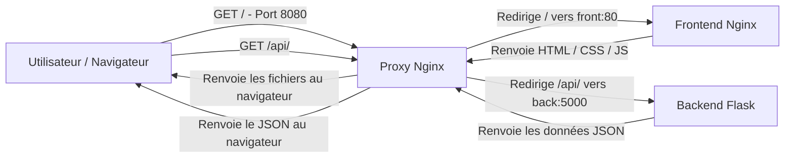

# Architecture du projet

Le projet est composé de trois services Docker :

- `front` : affiche l’interface du catalogue de cookies
- `back` : fournit les données des cookies via une API Flask
- `proxy` : reçoit les requêtes HTTP et les redirige vers le frontend ou le backend

L’utilisateur accède uniquement au proxy sur le port `8080`.

Les requêtes vers `/` sont envoyées vers le frontend.

Les requêtes vers `/api/` sont envoyées vers le backend.

## Frontend

Le frontend utilise l’image `nginx:alpine`.

J’ai choisi Nginx car le frontend est statique et contient uniquement du HTML, du CSS et du JavaScript. Nginx suffit donc pour servir les fichiers au navigateur.

La version Alpine permet d’utiliser une image plus légère.

Le `Dockerfile` copie les fichiers du frontend dans le dossier utilisé par Nginx pour servir les pages web.

Le frontend utilise le port `80` dans son conteneur.

## Backend

Le backend utilise l’image `python:3.12-alpine`.

J’ai choisi Python avec Flask car le projet a seulement besoin d’une petite API simple pour renvoyer les données du catalogue de cookies.

Le fichier `requirements.txt` contient les dépendances Python nécessaires. Flask est installé pendant le build avec `pip`.

Le dossier de travail du conteneur est `/app`.

Les données du catalogue sont stockées dans `data/cookies.json` afin de séparer les données de la logique applicative. Le backend charge ce fichier pour renvoyer les cookies via l’API.

Le backend utilise le port `5000` dans son conteneur.

La commande `CMD ["python", "app.py"]` lance l’application Flask au démarrage du conteneur.

Le backend gère aussi le signal `SIGTERM` afin de s’arrêter proprement lorsqu’un arrêt est demandé par Docker.

## Proxy

Le proxy utilise aussi l’image `nginx:alpine`.

Son rôle est de servir de point d’entrée unique pour l’application.

Les requêtes vers `/` sont redirigées vers le frontend.

Les requêtes vers `/api/` sont redirigées vers le backend.

Le proxy utilise le port `80` dans son conteneur et expose le port défini dans le fichier `.env` sur la machine hôte.

## Rôle des deux serveurs Nginx

Le projet utilise deux conteneurs Nginx mais ils ont des rôles différents.

Le Nginx du frontend sert uniquement les fichiers statiques de l’interface comme `index.html` et `style.css`.

Le Nginx du proxy sert de point d’entrée unique pour l’application. Il reçoit les requêtes envoyées par le navigateur et décide vers quel service les rediriger.

Une requête vers `/` est envoyée vers le Nginx du frontend qui renvoie ensuite les fichiers du site au navigateur.

Une requête vers `/api/` est envoyée vers le backend Flask qui renvoie les données JSON. La réponse repasse ensuite par le proxy avant d’être renvoyée au navigateur.

L’utilisateur ne communique donc jamais directement avec le frontend ou le backend : toutes les requêtes passent d’abord par le proxy.

## Docker Compose

Docker Compose permet de lancer et d’orchestrer les trois services du projet.

Le service `proxy` dépend du `front` et du `back` grâce à `depends_on`.

Les trois services communiquent à travers le réseau Docker personnalisé `cookie-network`.

Seul le proxy expose un port vers la machine hôte. Le frontend et le backend restent accessibles uniquement depuis le réseau interne Docker.

Le port du proxy ainsi que les limites de ressources sont définis dans le fichier `.env`.

Des limites de ressources sont définies pour chaque service :

| Service | Mémoire | CPU |
|---|---:|---:|
| Front | 128 MiB | 0.25 |
| Back | 256 MiB | 0.50 |
| Proxy | 128 MiB | 0.25 |

Le backend possède plus de ressources car Python et Flask sont plus lourds que Nginx.

## Cycle de vie et arrêt des conteneurs

Un conteneur reste actif tant que son processus principal est en cours d’exécution.

Pour le backend, le processus principal est `python app.py`.

Lors d’un `docker stop` ou d’un `docker compose down`, Docker envoie d’abord un signal `SIGTERM` au processus principal pour lui demander de s’arrêter proprement.

Le backend intercepte ce signal dans `app.py`, affiche un message puis termine le programme avec `sys.exit(0)`.

Si un processus ne s’arrête pas correctement après le `SIGTERM`, Docker peut ensuite forcer son arrêt.

## Schéma des communications

