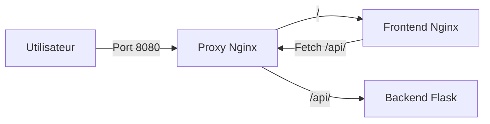

# Architecture du projet

Le projet est composé de trois services Docker :

- `front` : affiche l’interface du catalogue de cookies
- `back` : fournit les données des cookies via une API Flask
- `proxy` : reçoit les requêtes HTTP et les redirige vers le frontend ou le backend

L’utilisateur accède uniquement au proxy sur le port `8080`.

Les requêtes vers `/` sont envoyées vers le frontend.

Les requêtes vers `/api/` sont envoyées vers le backend.

## Frontend

Le frontend utilise l’image `nginx:alpine`.

J’ai choisi Nginx car le frontend est statique et contient uniquement du HTML et du CSS. Nginx suffit donc pour servir les fichiers au navigateur.

La version Alpine permet d’utiliser une image plus légère.

Le `Dockerfile` copie les fichiers du frontend dans le dossier utilisé par Nginx pour servir les pages web.

Le frontend utilise le port `80` dans son conteneur.

## Backend

Le backend utilise l’image `python:3.12-alpine`.

J’ai choisi Python avec Flask car le projet a seulement besoin d’une petite API simple pour renvoyer les données du catalogue de cookies.

Le fichier `requirements.txt` contient les dépendances Python nécessaires. Flask est installé pendant le build avec `pip`.

Le dossier de travail du conteneur est `/app`.

Le backend utilise le port `5000` dans son conteneur.

La commande `CMD ["python", "app.py"]` lance l’application Flask au démarrage du conteneur.

Le backend gère aussi le signal `SIGTERM` afin de s’arrêter proprement lorsqu’un arrêt est demandé par Docker.

## Proxy

Le proxy utilise aussi l’image `nginx:alpine`.

Son rôle est de servir de point d’entrée unique pour l’application.

Les requêtes vers `/` sont redirigées vers le frontend.

Les requêtes vers `/api/` sont redirigées vers le backend.

Le proxy utilise le port `80` dans son conteneur et expose le port `8080` sur la machine hôte.

## Docker Compose

Docker Compose permet de lancer et d’orchestrer les trois services du projet.

Le service `proxy` dépend du `front` et du `back` grâce à `depends_on`.

Seul le proxy expose un port vers la machine hôte avec `8080:80`. Le frontend et le backend restent accessibles uniquement depuis le réseau interne Docker.

Des limites de ressources sont définies pour chaque service :

| Service | Mémoire | CPU |
|---|---:|---:|
| Front | 128 MiB | 0.25 |
| Back | 256 MiB | 0.50 |
| Proxy | 128 MiB | 0.25 |

Le backend possède plus de ressources car Python et Flask sont plus lourds que Nginx.

## Cycle de vie et arrêt des conteneurs

Un conteneur reste actif tant que son processus principal est en cours d’exécution.

Pour le backend, le processus principal est `python app.py`.

Lors d’un `docker stop` ou d’un `docker compose down`, Docker envoie d’abord un signal `SIGTERM` au processus principal pour lui demander de s’arrêter proprement.

Le backend intercepte ce signal dans `app.py`, affiche un message puis termine le programme avec `sys.exit(0)`.

Si un processus ne s’arrête pas correctement après le `SIGTERM`, Docker peut ensuite forcer son arrêt.

## Schéma des communications

